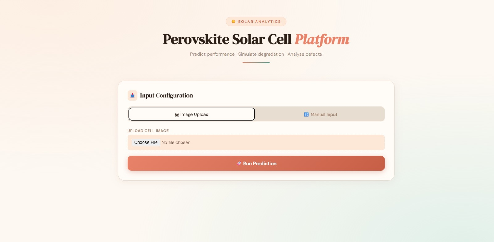
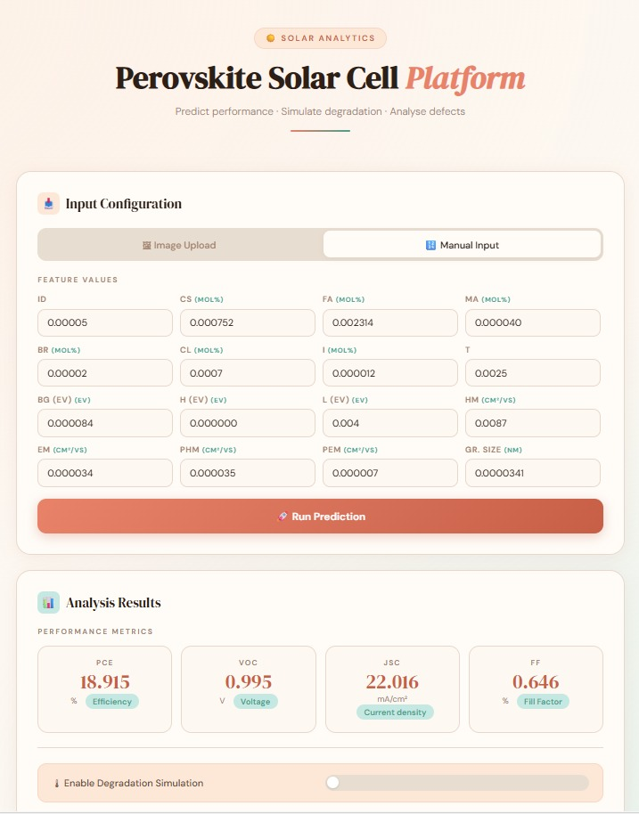
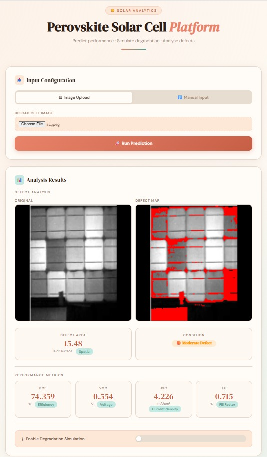
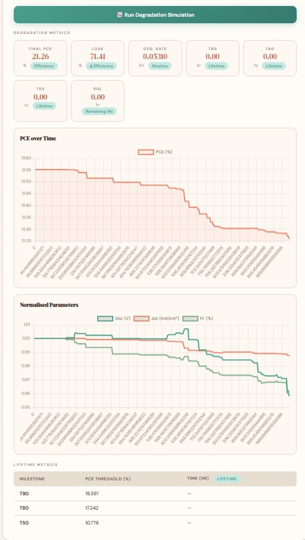

# 🔬 PerovSight

> **Multi-modal platform for perovskite solar cell analysis and degradation prediction**

PerovSight is a full-stack web application that integrates three distinct machine learning models into a single unified interface for perovskite solar cell analysis. Users can predict cell efficiency from material parameters, detect defects from microscopy images, and simulate long-term degradation behavior — all through one seamless pipeline.

---

## ✨ Features

- **Three-model inference pipeline** — A Keras MLP (tabular prediction), an OpenCV-based image analysis model, and a Random Forest degradation model are all accessible through a single `/predict/full` endpoint that chains them automatically.
- **Tabular property prediction** — Input 16 material parameters (composition, halide ratios, bandgap, carrier mobility, grain size, etc.) and receive predictions for PCE, Voc, Jsc, and Fill Factor.
- **Image-based defect detection** — Upload a microscopy image of a solar cell panel; the system detects defect regions, quantifies defect percentage, estimates electrical properties, and returns a color-annotated result image highlighting damaged areas.
- **Degradation simulation** — Given initial cell parameters and environmental conditions (temperature, humidity, stress time, ISOS protocol), the model simulates how PCE, Voc, Jsc, and FF decay over time and computes T90 / T80 / T50 / RUL lifetime metrics.
- **Full pipeline mode** — A single API call can run tabular or image prediction in step 1, then feed those results directly into degradation modeling in step 2.
- **Interactive frontend** — A clean vanilla JS interface lets users switch between input modes, enter parameters, upload images, and view results including degradation curves rendered with Chart.js.
- **FastAPI backend** — Async endpoints with CORS support, served via Uvicorn on port 8000.

---

## 🛠 Technologies Used

| Layer | Tools |
|---|---|
| **Backend** | Python 3.10, FastAPI, Uvicorn |
| **Frontend** | HTML, CSS, JavaScript, Chart.js |
| **ML — Model 1** | TensorFlow / Keras (MLP — tabular prediction) |
| **ML — Model 2** | OpenCV, Pillow (image defect analysis) |
| **ML — Model 3** | Scikit-learn / joblib (Random Forest — degradation) |
| **Numerical Computing** | NumPy |
| **Version Control** | Git, GitHub |

---

## 🗂 Project Structure

```
PerovSight/
│
├── backend/
│   ├── main.py                          # FastAPI app, route definitions, full pipeline
│   ├── requirements.txt                 # Python dependencies
│   │
│   ├── services/                        # Inference logic per model
│   │   ├── model1_service.py            # predict_tabular() — MLP inference
│   │   ├── model2_service.py            # predict_image() — defect detection
│   │   └── model3_service.py            # predict_degradation() — RF inference
│   │
│   └── models/
│       ├── model1/
│       │   ├── perovskite_mlp_model.keras   # Trained Keras MLP
│       │   ├── scaler.pkl                   # Feature scaler
│       │   ├── target_scaler.pkl            # Output scaler
│       │   └── feature_names.json           # Ordered input feature list
│       ├── model2/
│       │   └── solar_model.h5               # (reserved / future use)
│       └── model3/
│           ├── rf_model.pkl                 # Trained Random Forest
│           ├── rf_scaler.pkl                # Feature scaler
│           └── ml/
│               └── predict.py               # Curve generation & lifetime metrics
│
└── frontend/
    ├── index.html                       # Main UI — tabs, forms, results display
    ├── app.js                           # API calls, dynamic form rendering, Chart.js
    └── style.css                        # Styling (DM Sans / DM Serif Display)
```

---

## ⚙️ Installation

### Prerequisites

- Python 3.10 or higher
- `pip` package manager
- A modern web browser

### 1. Clone the repository

```bash
git clone https://github.com/SrinikaRaktani/PerovSight.git
cd PerovSight
```

### 2. Set up a virtual environment

```bash
python -m venv venv
source venv/bin/activate        # On Windows: venv\Scripts\activate
```

### 3. Install backend dependencies

```bash
cd backend
pip install -r requirements.txt
```

> **Note:** The `requirements.txt` includes TensorFlow, Scikit-learn, OpenCV, FastAPI, and all other dependencies. Installation may take a few minutes.

---

## 🚀 Running the Project

### Start the backend server

```bash
cd backend
python main.py
```

The API will be available at `http://127.0.0.1:8000`.  
FastAPI's interactive docs are at `http://127.0.0.1:8000/docs`.

### Open the frontend

Open `frontend/index.html` directly in your browser, or serve it with a static file server:

```bash
cd frontend
python -m http.server 3000
```

Then navigate to `http://localhost:3000`.

> **Important:** The frontend expects the backend at `http://127.0.0.1:8000`. Make sure the backend is running before making predictions.

---

## 🤖 Model Information

PerovSight integrates three trained models, each targeting a different analysis task. All three can be chained together through the `/predict/full` endpoint.

### Model 1 — Tabular MLP (Keras)
- **File:** `models/model1/perovskite_mlp_model.keras`
- **Task:** Predicts PCE (%), Voc (V), Jsc (mA/cm²), and Fill Factor (%) from 16 material parameters
- **Input features:** ID, Cs, FA, MA (composition); Br, Cl, I (halide ratios); tolerance factor (t); bandgap BG (eV); HOMO H (eV), LUMO L (eV); hole/electron mobility hm, em (cm²/Vs); perovskite hole/electron mobility Phm, Pem (cm²/Vs); grain size (nm)
- **Preprocessing:** StandardScaler on inputs and outputs (scalers stored as `.pkl`)

### Model 2 — Image Defect Analyser (OpenCV)
- **Task:** Detects and quantifies defects in grayscale solar cell images
- **Method:** Pixel intensity thresholding on a 128×128 normalized image; defect percentage drives electrical property estimation
- **Output:** Defect percentage, estimated PCE/Voc/Jsc/FF, condition label (Healthy → Critical), and a red-annotated defect image (base64)

### Model 3 — Degradation Random Forest (Scikit-learn)
- **File:** `models/model3/rf_model.pkl`
- **Task:** Simulates time-series degradation of PCE, Voc, Jsc, and FF under specified environmental stress
- **Inputs:** Initial cell parameters + Temperature (°C), Humidity (% RH), Stress duration (hours), ISOS protocol (ISOS-D-1/2, ISOS-L-1/2, ISOS-O-1)
- **Output:** Degradation curves (300 points), efficiency loss, degradation rate, T90/T80/T50 lifetimes, and Remaining Useful Life (RUL)

### API Endpoints

| Method | Endpoint | Description |
|---|---|---|
| `GET` | `/` | Health check |
| `POST` | `/predict/tabular` | Model 1 — tabular prediction |
| `POST` | `/predict/image` | Model 2 — image defect detection |
| `POST` | `/predict/degradation` | Model 3 — degradation simulation |
| `POST` | `/predict/full` | Full pipeline (Model 1 or 2 → optional Model 3) |

---

## 📸 Screenshots

### 🏠 Main Interface



---

### 📊 Prediction Results



---

### 📷 Image Upload & Defect Detection



---

### 📈 Degradation Curves



---


## 🔮 Future Improvements

- [ ] Add batch prediction support via CSV upload
- [ ] Display confidence intervals alongside predictions
- [ ] Extend the degradation model to support additional ISOS protocols
- [ ] Add a materials database for parameter lookup and auto-fill
- [ ] Containerize with Docker for reproducible deployment
- [ ] Deploy backend to a cloud platform (e.g., Render, Railway, or AWS)
- [ ] Add model explainability (e.g., SHAP values for feature importance)
- [ ] Export results as PDF reports

---


## 👤 Author

**SrinikaRaktani**

- GitHub: [@SrinikaRaktani](https://github.com/SrinikaRaktani)
- Email: <srinikaraktani@gmail.com>
- LinkedIn: [linkedin.com/in/srinika-raktani-289672368](https://www.linkedin.com/in/srinika-raktani-289672368)

---

<div align="center">
  <sub>Built with ☕ and a lot of curiosity about perovskites.</sub>
</div>